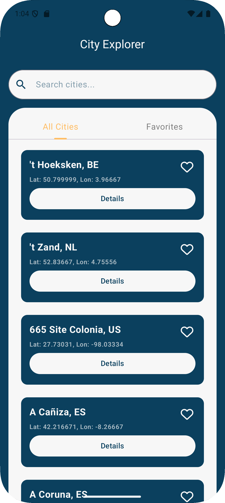

# Ualá City Mobile Challenge

Este repositorio contiene la resolución del "Mobile Challenge - Engineer" propuesto por Ualá.

## **Descripción del Desafío y Características Principales**

El objetivo de este desafío es evaluar las habilidades de resolución de problemas, el juicio de experiencia de usuario (UX) y la calidad del código, considerando un enfoque de nivel de producción.

El punto de partida es una lista de aproximadamente 200,000 ciudades en formato JSON, accesible desde un gist, donde cada entrada incluye el país, nombre, ID y coordenadas.

Las **características principales** implementadas son:

* **Gestión de Datos y Arquitectura:**
    * **Carga de datos estáticos desde un archivo JSON** para la población inicial de la base de datos.
    * **Consumo de APIs externas (Google Static Maps y API Ninjas)** para obtener imágenes estáticas de mapas e información detallada de ciudades y países.
    * **Uso de paginación** para el manejo eficiente de grandes volúmenes de datos en la capa de presentación.
    * **Implementación de queries específicas en la base de datos** (búsquedas por par ciudad-país, paginación) para optimizar la carga de recursos y las búsquedas.
    * **Uso del plugin de secretos** para proteger y no propagar las API keys.
    * Adopción de una **arquitectura MVI (Model-View-Intent)** con interacción reactiva mediante **Kotlin Flows y Coroutines** para una gestión de estado predecible y un código más mantenible.
    * **Inyección de Dependencias (DI) con Hilt**, facilitando la modularidad y la testabilidad.

* **Búsqueda y Filtrado Avanzado:**
    * Filtrado de ciudades por un prefijo dado (ej. "Al" para "Alabama", "Albuquerque").
    * Optimización para búsquedas rápidas y eficientes.
    * Búsqueda insensible a mayúsculas y minúsculas.
    * Actualización instantánea de la lista con cada carácter ingresado o eliminado en el filtro.
    * Capacidad de filtrar solo las ciudades marcadas como favoritas.

* **Visualización de la Lista Enriquecida:**
    * Muestra las ciudades en una lista deslizable con un diseño claro.
    * Ordenamiento alfabético por ciudad y luego por país.
    * Cada celda de ciudad muestra el nombre de la ciudad, código de país, coordenadas y una opción para marcar/desmarcar como favorita.
    * **Diseño adaptable:** Interfaz de usuario dinámica que se ajusta a la orientación del dispositivo (pantallas separadas en vertical, diseño de dos paneles en horizontal para una mejor utilización del espacio).

* **Navegación y Detalles Completos:**
    * Al tocar una ciudad, navega a un mapa que muestra sus coordenadas.
    * Pantalla de información detallada para cada ciudad, incluyendo datos adicionales no mostrados en la lista principal y, opcionalmente, de una fuente externa.

* **Experiencia de Usuario (UX) y Persistencia:**
    * Las ciudades favoritas se guardan y recuerdan entre los lanzamientos de la aplicación, garantizando una experiencia continua.
    * Transiciones y estados de carga bien manejados para una UX fluida.

* **Calidad del Código:**
    * Implementación de tests unitarios para el algoritmo de búsqueda y las consultas a la base de datos.
    * Desarrollo prioritario en Kotlin para Android.
    * Uso exclusivo de **Jetpack Compose para la construcción de la UI**, evitando librerías de terceros para este fin.
    * Manejo robusto de respuestas de APIs y operaciones atómicas de base de datos.

**Nota sobre los Tests de Instrumentación:**

A pesar de los esfuerzos significativos y la aplicación de diversas estrategias, la implementación de tests de instrumentación para la interfaz de usuario **resultó infructuosa** debido a problemas persistentes con la sincronización del reloj de Compose y el entorno de pruebas, lo que impedía que las animaciones de carga fueran detectadas como ociosas o que los componentes se renderizaran correctamente en el tiempo esperado. Los tests unitarios para la lógica de negocio y la base de datos se implementaron satisfactoriamente.

---

## **Etapas de Desarrollo del Ualá City Mobile Challenge**

El proyecto se desarrolló en varias etapas lógicas, cada una abordando un conjunto específico de funcionalidades y desafíos arquitectónicos:

### **1. Configuración Inicial y Funcionalidad Básica de Búsqueda y Favoritos**
Esta etapa sentó las bases del proyecto, estableciendo la estructura fundamental y desarrollando las funcionalidades esenciales de búsqueda y un primer acercamiento a los favoritos.

* **Commits involucrados:**
  * Kick-off
  * CMC-01
  * CMC-02
  * CMC-03
  * CMC-04
  * CMC-05
  * CMC-06

---

### **2. Implementación de Persistencia y Optimización Reactiva Inicial**
En esta fase, se introdujo la capacidad de persistir los datos de favoritos y se abordaron los desafíos de rendimiento y reactividad en la interfaz de usuario, incluyendo un primer intento de paginación.

* **Commits involucrados:**
  * CMC-07
  * CMC-08
  * CMC-09
  * CMC-10
  * CMC-11

---

### **3. Integración de Inyección de Dependencias y Consumo de APIs Externas**
Esta etapa se centró en la mejora de la arquitectura con la integración de un framework de inyección de dependencias (Hilt) y en la incorporación de funcionalidades a través del consumo de APIs externas para mapas y detalles.

* **Commits involucrados:**
  * CMC-12
  * CMC-13
  * CMC-14
  * CMC-15
  * CMC-16
  * CMC-17
  * CMC-18

---

### **4. Diseño de UI Adaptativa y Refinamiento de Modelos de Datos**
En esta fase, se implementó la interfaz de usuario adaptativa para diferentes orientaciones (dos paneles) y se trabajó en la consistencia de los modelos de datos de UI, así como en la integración de información y recursos visuales adicionales.

* **Commits involucrados:**
  * CMC-19
  * CMC-20
  * CMC-21
  * CMC-22
  * CMC-23
  * CMC-24
  * CMC-25
  * CMC-26

---

### **5. Mejora de Filtros, Estilización y Robustez de APIs**
Esta etapa se enfocó en mejorar las capacidades de ordenamiento y filtrado, aplicar estilos a la interfaz de usuario, refinar el manejo de respuestas de APIs y asegurar la fiabilidad de las funciones de búsqueda y datos.

* **Commits involucrados:**
  * CMC-27
  * CMC-28
  * CMC-29
  * CMC-30
  * CMC-31
  * CMC-32
  * CMC-33
  * CMC-34
  * CMC-35

---

### **6. Refinamientos Arquitectónicos Finales y Estabilización de Funcionalidades Clave**
Esta etapa se dedicó a las últimas refactorizaciones arquitectónicas importantes (especialmente en MVI), la implementación exitosa de la paginación y la garantía de la robustez y atomicidad de las operaciones críticas de la base de datos. También se creó la primera versión del documento README.md.

* **Commits involucrados:**
  * CMC-36
  * CMC-37
  * CMC-38
  * CMC-39
  * CMC-40
  * CMC-41
  * CMC-42
  * CMC-43

---

### **7. Definición de Tests**
En esta etapa se implementaron tests unitarios sobre las consultas (queries) de la entidad `City` de la base de datos. A pesar de los esfuerzos, los tests instrumentales de UI no pudieron ser completados satisfactoriamente debido a problemas de sincronización en el entorno de pruebas.

* **Commits involucrados:**
  * CMC-44
  * CMC-45

---

## **Nota Importante sobre la Gestión de Secretos**

Para este desafío, se implementó el uso del **plugin de secretos de Gradle** con el objetivo de demostrar una buena práctica teórica en la gestión segura de API keys y credenciales sensibles. Sin embargo, para el correcto funcionamiento y la facilidad de uso de la aplicación en este contexto de prueba, **las API keys y otros secretos necesarios para el consumo de servicios externos van a ser expuestos directamente en el código o en archivos de configuración accesibles**. Esto se hace con fines demostrativos y para asegurar que la aplicación sea completamente funcional sin pasos adicionales de configuración de credenciales por parte del revisor.

---

## **Capturas de Pantalla**

Muestras de la interfaz gráfica de la aplicación

  

  **1. Vista principal de la lista de ciudades.**

  

  **2. Vista de la lista de ciudades, mostrando ciudades favoritas.**

  

  **3. Pestaña de ciudades favoritas, sin elementos.**

  

  **4. Pestaña de ciudades favoritas con elementos.**

  

  **5. Vista del mapa.**

  

  **6. Vista del detalle de ciudad.**

  

  **7. Vista de la pantalla principal en modo horizontal, con mapa.**

  

  **8. Vista de la pantalla principal en modo horizontal, con detalles de la ciudad.**

---